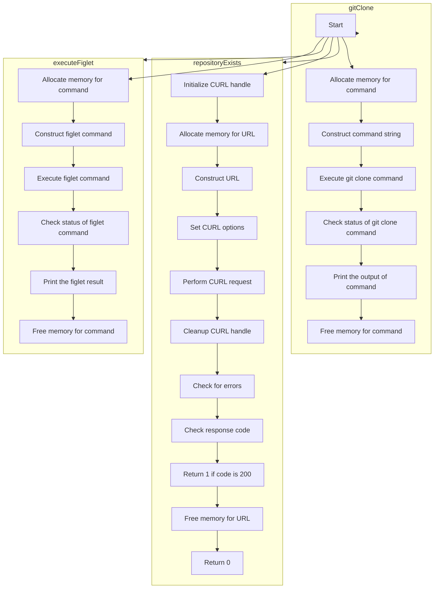

<h1 align=center>aitshal</h1>
aitshal is a linux command-line tool designed by <a href="https://github.com/AitzazImtiaz/">Aitzaz Imtiaz</a> under the aid of B-Consortium, in intention to develop a universal package installer for all C-style supported packaes developed by the consortium. 

## Background
The consortium passed down its directive to use linux machines (i.e. Debian based systems) and preferred it over the traditional Windows Microsoft backed Graphical User Interface development. Also agreeing by, no use of ``VS`` components included the scope of directive despite the consortium developing <a href="https://github.com/B-Consortium/ImtiazGermain">ImtiazGermain</a> which is a ``.lib`` implementation of cryptographical layer imprint of the consortium which can be aided to windows primarily. The consortium reviews the Microsoft Corporation practices to consider it that Widnows is not best suited for  any software development suite due to which the consortium needed a best environment for ease of software uses, which make CLI usage the best experience thereof. However, with inspiration from Torvald's tool ``git``, and in fact the use of linux's installation manager ``apt`` pushed the consortium to write and integrate its own package manager and installer, the all-time core downloader of tools, ``aitshal``.

## Development Stages


## Installation 
``aitshal`` needs tools like ``gcc``, ``make``,``curl``,``openssl`` and tools to compile both ``make`` and C projects. In that scenario, we can begin like:

```
git clone https://github.com/B-Consortium/aitshal
cd aitshal
make aitshal
sudo make install
```
